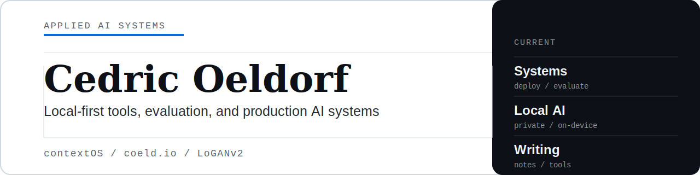

<picture>
  
</picture>

I work on applied AI systems, data infrastructure, and operational tooling.

Most of my recent work is about getting AI into real workflows, with attention to evaluation, governance, and operating constraints. I currently work with portfolio companies on applied AI deployments, build local AI applications, and publish notes and tools at [coeld.io](https://coeld.io).

[Website / Blog](https://coeld.io) · [LinkedIn](https://www.linkedin.com/in/cedricoeldorf) · [X / Twitter](https://x.com/cedrocino) · [Resume](./resume.md)

## Current focus

- Deploying AI systems into production environments at Growth Factors
- Building local AI applications and workflow tools
- Writing public notes, blog posts, and tooling at [coeld.io](https://coeld.io)

## Selected work

| Project | Summary |
| --- | --- |
| [work-os](https://github.com/cedricoeldorf/work-os) | AI-first local work OS with Python core services, SQLite, a FastAPI backend, and a React dashboard. |
| [coeld](https://github.com/cedricoeldorf/coeld) | Personal site and system index for writing, notes, and small AI tools. |
| [ConditionalStyleGAN](https://github.com/cedricoeldorf/ConditionalStyleGAN) | MSc research project on controllable logo generation with StyleGAN. Presented at ICMLA 2019. |
| [proba-v-super-resolution-challenge](https://github.com/cedricoeldorf/proba-v-super-resolution-challenge) | Satellite imagery super-resolution project built around CNN-based modelling and data preparation. |

## Background

- Operating Principal, Agentic AI, Growth Factors (Bregal Unternehmerkapital)
- Former Head of Operations Analytics, Bolt
- Previous machine learning engineering work at Ericsson and DataProphet

## Areas I care about

- Agent systems and evaluation
- Local-first AI tools
- Human-AI collaboration
- Data platforms and operational decision support
